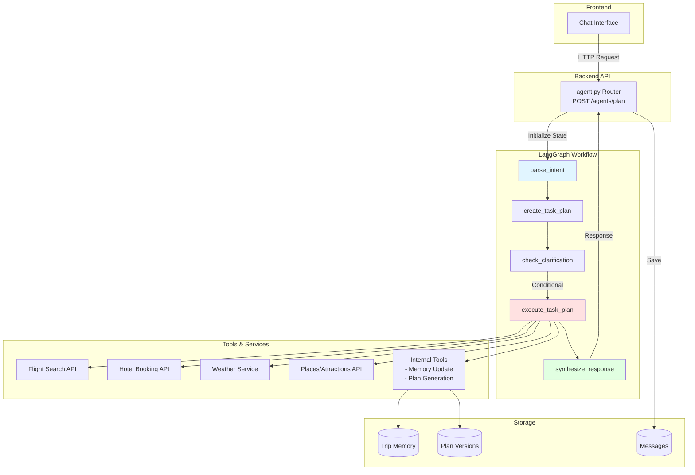
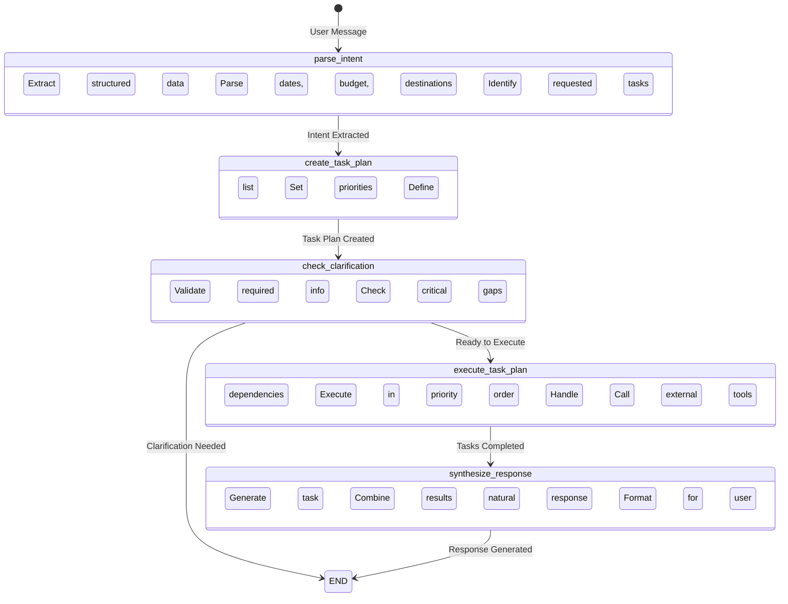
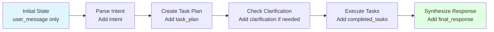

# Agentic Planning with LangGraph

A comprehensive guide to designing, implementing, and using the AI agent system for intelligent trip planning in NomadSync.

## 📋 Table of Contents

- [Overview](#-overview)
- [Architecture](#-architecture)
- [Agent Workflow](#-agent-workflow)
- [Using the Agents](#-using-the-agents)
- [Designing Agents](#-designing-agents)
- [Tool Calling Architecture](#-tool-calling-architecture)
- [State Management](#-state-management)
- [Memory Integration](#-memory-integration)
- [Implementation Roadmap](#-implementation-roadmap)
- [Best Practices](#-best-practices)
- [Troubleshooting](#-troubleshooting)

## 🎯 Overview

The NomadSync agentic planning system uses **LangGraph** to orchestrate AI agents that understand natural language travel requests, extract structured trip information, plan and execute tasks, and generate personalized travel itineraries.

### Key Features

- **Natural Language Understanding**: Parses user messages into structured trip data
- **Task Planning**: Generates ordered, dependency-aware task lists
- **Clarification Handling**: Identifies missing critical information
- **Tool Execution**: Executes tasks using external APIs and services
- **Response Synthesis**: Generates human-readable, contextual responses
- **Memory Integration**: Auto-updates trip memory from conversations
- **Plan Generation**: Creates versioned trip plans from task results

### Technology Stack

- **LangGraph**: Agent workflow orchestration and state management
- **OpenAI GPT-4o-mini**: LLM for intent extraction and response generation
- **FastAPI**: Backend API for agent endpoints
- **MongoDB**: Persistent storage for trip memory and plans
- **Pydantic**: Type-safe data validation and models

## 🏗 Architecture

### System Architecture



### Component Overview

| Component | Responsibility | Location |
|-----------|---------------|----------|
| **Agent Router** | HTTP endpoint, request/response handling | `backend/app/routers/agent.py` |
| **Workflow Graph** | LangGraph state machine definition | `backend/app/agents/langgraph_workflow.py` |
| **Intent Parser** | Natural language → structured data | `parse_intent()` function |
| **Task Planner** | Generate ordered task execution plan | `create_task_plan()` function |
| **Task Executor** | Execute tasks via tools/APIs | `execute_task_plan()` function |
| **Response Synthesizer** | Generate natural language responses | `synthesize_response()` function |
| **Memory Updater** | Update trip memory from intent | `_update_memory_from_intent()` function |
| **Plan Generator** | Create plan versions from tasks | `_generate_plan_from_tasks()` function |

## 🔄 Agent Workflow

### Current Workflow Graph



### Execution Flow

1. **Parse Intent** (`parse_intent`)
   - Input: User message, trip context, trip memory
   - Process: OpenAI JSON schema extraction
   - Output: `TripIntent` object with structured data

2. **Create Task Plan** (`create_task_plan`)
   - Input: Intent, trip memory
   - Process: Generate ordered tasks based on `requested_tasks`
   - Output: `TaskPlan` with priority-sorted tasks

3. **Check Clarification** (`check_clarification`)
   - Input: Task plan
   - Process: Validate if clarification is required
   - Output: Clarification message or proceed flag

4. **Execute Task Plan** (`execute_task_plan`)
   - Input: Task plan, completed tasks context
   - Process: Execute tasks respecting dependencies and priorities
   - Output: Completed tasks dictionary

5. **Synthesize Response** (`synthesize_response`)
   - Input: Intent, completed tasks
   - Process: Generate natural language response using OpenAI
   - Output: Final response string

## 🚀 Using the Agents

### API Endpoint

```http
POST /api/agents/plan
Authorization: Bearer <access_token>
Content-Type: application/json

{
  "message": "I want to visit Tokyo for 7 days in March with a budget of $3000",
  "trip_id": "696c1d6de35d01da9dad9478",
  "trip_context": {
    "title": "Japan Adventure",
    "destination": "Tokyo, Japan",
    "status": "draft"
  },
  "trip_memory": {
    "destination": {
      "value": "Tokyo, Japan",
      "confidence": 90
    },
    "budget": {
      "value": "$3000",
      "confidence": 85
    }
  }
}
```

### Response Format

```json
{
  "clarification": null,
  "response": "I've found some great options for your Tokyo trip! ...",
  "intent": {
    "destinations": ["Tokyo"],
    "duration_days": 7,
    "budget_total": 3000,
    "requested_tasks": ["flights", "hotels", "itinerary"],
    ...
  },
  "task_plan": {
    "tasks": [
      {
        "task_id": "search_flights",
        "agent": "research",
        "action": "search_flights",
        "priority": 1,
        ...
      }
    ]
  },
  "completed_tasks": {
    "search_flights": {...},
    "search_hotels": {...},
    ...
  }
}
```

### Frontend Integration

```typescript
// src/services/agent.ts
import { apiClient } from '../lib/api';

export interface AgentRequest {
  message: string;
  trip_id?: string;
  trip_context?: Record<string, any>;
  trip_memory?: Record<string, any>;
}

export interface AgentResponse {
  clarification?: string;
  response?: string;
  intent?: Record<string, any>;
  task_plan?: Record<string, any>;
  completed_tasks: Record<string, any>;
}

export const agentService = {
  async runAgent(request: AgentRequest): Promise<AgentResponse> {
    return apiClient.post<AgentResponse>('/agents/plan', request);
  }
};
```

### Usage in React Component

```typescript
// src/components/TripPlanner.tsx
const handleSendMessage = async (content: string) => {
  // Create user message
  await messagesService.create(tripId, {
    type: 'human',
    content,
  });

  // Run agent workflow
  const agentResponse = await agentService.runAgent({
    message: content,
    trip_id: tripId,
    trip_context: tripData,
    trip_memory: memoryData,
  });

  // Handle clarification
  if (agentResponse.clarification) {
    await messagesService.create(tripId, {
      type: 'agent',
      content: agentResponse.clarification,
    });
    return;
  }

  // Save agent response
  if (agentResponse.response) {
    await messagesService.create(tripId, {
      type: 'agent',
      content: agentResponse.response,
    });
  }

  // Memory and plan automatically updated by backend
};
```

## 🎨 Designing Agents

### Agent Design Principles

1. **Single Responsibility**: Each agent should handle one type of task
2. **Stateless**: Agents operate on state, don't maintain internal state
3. **Composable**: Agents can be chained and combined
4. **Observable**: All agent actions should be traceable
5. **Error-Resilient**: Handle failures gracefully

### Agent Types

#### 1. Research Agent (`agent: "research"`)

Handles information gathering tasks:

```python
class ResearchAgent:
    async def search_flights(self, params: Dict[str, Any]) -> Dict[str, Any]:
        """Search for flight options"""
        # Connect to Amadeus, Skyscanner, or Google Flights API
        pass
    
    async def search_hotels(self, params: Dict[str, Any]) -> Dict[str, Any]:
        """Search for hotel options"""
        # Connect to Booking.com, Expedia, or Hotels.com API
        pass
    
    async def get_weather_forecast(self, params: Dict[str, Any]) -> Dict[str, Any]:
        """Get weather forecast"""
        # Connect to OpenWeatherMap API
        pass
    
    async def search_attractions(self, params: Dict[str, Any]) -> Dict[str, Any]:
        """Search for attractions and activities"""
        # Connect to Google Places, TripAdvisor, or Yelp API
        pass
```

#### 2. Itinerary Agent (`agent: "itinerary"`)

Handles itinerary planning tasks:

```python
class ItineraryAgent:
    async def create_day_plan(
        self, 
        day_number: int,
        destination: str,
        attractions: List[Dict],
        weather: Dict,
        constraints: List[str]
    ) -> Dict[str, Any]:
        """Create a day-by-day itinerary"""
        # Use LLM to plan activities considering:
        # - Weather conditions
        # - Opening hours
        # - Travel time between locations
        # - User preferences and constraints
        pass
    
    async def optimize_route(
        self,
        activities: List[Dict],
        start_location: str
    ) -> List[Dict]:
        """Optimize activity order for minimal travel"""
        # Use Google Maps API or routing algorithm
        pass
```

#### 3. Booking Agent (`agent: "booking"`)

Handles reservation tasks (future):

```python
class BookingAgent:
    async def book_flight(self, flight_option: Dict) -> Dict[str, Any]:
        """Book a flight reservation"""
        pass
    
    async def book_hotel(self, hotel_option: Dict) -> Dict[str, Any]:
        """Book a hotel reservation"""
        pass
```

### Defining Tasks

Tasks are defined in the `create_task_plan` function:

```python
# Example: Flight search task
if "flights" in intent.requested_tasks:
    tasks.append(
        TaskPlan.Task(
            task_id="search_flights",
            agent="research",  # Agent type
            action="search_flights",  # Action name
            parameters={
                "origin": intent.origin,
                "destination": intent.destinations[0],
                "departure_date": intent.start_date,
                "return_date": intent.end_date,
                "passengers": intent.group_size,
            },
            depends_on=[],  # No dependencies
            priority=1,  # High priority
        )
    )
```

### Task Dependencies

Tasks can depend on other tasks:

```python
# Weather must be fetched before planning day
tasks.append(
    TaskPlan.Task(
        task_id="plan_day_1",
        agent="itinerary",
        action="create_day_plan",
        depends_on=["get_weather", "search_attractions"],  # Wait for these
        priority=3,
    )
)
```

## 🔧 Tool Calling Architecture

### Tool Registration

Tools are functions that agents can call. Register them in `execute_single_task`:

```python
async def execute_single_task(task: TaskPlan.Task, context: Dict[str, Any]) -> Any:
    """Execute a single task using registered tools"""
    
    # Tool registry
    tools = {
        ("research", "search_flights"): search_flights_tool,
        ("research", "search_hotels"): search_hotels_tool,
        ("research", "get_weather_forecast"): get_weather_tool,
        ("research", "search_attractions"): search_attractions_tool,
        ("itinerary", "create_day_plan"): create_day_plan_tool,
    }
    
    # Lookup tool
    tool_key = (task.agent, task.action)
    if tool_key not in tools:
        return {
            "status": "error",
            "message": f"Tool not found: {tool_key}"
        }
    
    # Execute tool
    try:
        result = await tools[tool_key](task.parameters, context)
        return result
    except Exception as e:
        return {
            "status": "error",
            "message": str(e)
        }
```

### Tool Implementation Pattern

```python
async def search_flights_tool(
    parameters: Dict[str, Any],
    context: Dict[str, Any]
) -> Dict[str, Any]:
    """
    Search for flight options.
    
    Parameters:
        origin: Departure airport/city
        destination: Arrival airport/city
        departure_date: YYYY-MM-DD format
        return_date: YYYY-MM-DD format (optional)
        passengers: Number of travelers
    
    Returns:
        {
            "flights": [...],
            "total_price": float,
            "currency": "USD"
        }
    """
    # Extract parameters
    origin = parameters.get("origin")
    destination = parameters.get("destination")
    departure_date = parameters.get("departure_date")
    return_date = parameters.get("return_date")
    passengers = parameters.get("passengers", 1)
    
    # Call external API
    # Example: Amadeus API
    try:
        api_client = AmadeusClient(api_key=settings.amadeus_api_key)
        response = await api_client.search_flights(
            origin=origin,
            destination=destination,
            departure_date=departure_date,
            return_date=return_date,
            passengers=passengers,
        )
        
        return {
            "status": "success",
            "flights": response.get("data", []),
            "total_price": response.get("price", 0),
            "currency": response.get("currency", "USD"),
        }
    except Exception as e:
        return {
            "status": "error",
            "message": f"Flight search failed: {str(e)}"
        }
```

### Required Tool Integrations

| Tool | Provider | Status | Priority |
|------|----------|--------|----------|
| **Flight Search** | Amadeus, Skyscanner, Google Flights | 🔴 Not Implemented | High |
| **Hotel Search** | Booking.com, Expedia, Hotels.com | 🔴 Not Implemented | High |
| **Weather Forecast** | OpenWeatherMap, WeatherAPI | 🔴 Not Implemented | Medium |
| **Attractions Search** | Google Places, TripAdvisor, Foursquare | 🔴 Not Implemented | High |
| **Route Optimization** | Google Maps, Mapbox | 🔴 Not Implemented | Medium |
| **Restaurant Search** | Google Places, Yelp | 🔴 Not Implemented | Medium |
| **Currency Conversion** | ExchangeRate API, Fixer.io | 🔴 Not Implemented | Low |
| **Time Zone Lookup** | World Time API | 🔴 Not Implemented | Low |

### Tool Response Format

All tools should return a standardized format:

```python
{
    "status": "success" | "error" | "partial",
    "data": Any,  # Tool-specific data
    "metadata": {
        "provider": str,
        "timestamp": str,
        "cached": bool,
    },
    "error": Optional[str],
}
```

## 📊 State Management

### ExecutionState TypedDict

The workflow state is defined as:

```python
class ExecutionState(TypedDict):
    user_message: str  # Original user input
    trip_context: Dict[str, Any]  # Trip metadata
    trip_memory: Dict[str, Any]  # Extracted trip memory
    intent: Optional[TripIntent]  # Parsed intent
    task_plan: Optional[TaskPlan]  # Generated task plan
    clarification: Optional[str]  # Clarification message
    completed_tasks: Dict[str, Any]  # Task execution results
    final_response: Optional[str]  # Generated response
```

### State Flow



### State Immutability

LangGraph uses immutable state. Each node receives state and returns updated state:

```python
async def parse_intent(state: ExecutionState) -> ExecutionState:
    # Read from state
    user_message = state["user_message"]
    
    # Process...
    intent = parse_message(user_message)
    
    # Return updated state (creates new dict)
    new_state = state.copy()
    new_state["intent"] = intent
    return new_state
```

## 🧠 Memory Integration

### Auto-Update from Intent

The system automatically updates trip memory when an intent is extracted:

```python
# backend/app/routers/agent.py
if payload.trip_id and intent:
    await _update_memory_from_intent(payload.trip_id, intent, message_ref)
```

### Memory Fields Updated

- **Destination**: From `intent.destinations`
- **Dates**: From `intent.start_date` and `intent.end_date`
- **Duration**: From `intent.duration_days`
- **Budget**: From `intent.budget_total` or `intent.budget_per_person`
- **Pace**: Inferred from `intent.interests` and constraints

### Confidence Scoring

Memory fields include confidence scores (0-100):

```python
memory_updates["destination"] = {
    "value": destination_str,
    "confidence": 80,  # Default for new extractions
    "sources": [message_ref]
}
```

Confidence increases when the same value is confirmed multiple times:

```python
if existing_value["value"] == new_value["value"]:
    new_value["confidence"] = min(100, existing_value["confidence"] + 10)
```

## 🗺 Implementation Roadmap

### Phase 1: Foundation (Current) ✅

- [x] LangGraph workflow setup
- [x] Intent parsing with OpenAI
- [x] Task planning logic
- [x] Basic response synthesis
- [x] Memory integration
- [x] Plan generation scaffolding

### Phase 2: Tool Integration (Next)

- [ ] Flight search tool (Amadeus API)
- [ ] Hotel search tool (Booking.com API)
- [ ] Weather forecast tool (OpenWeatherMap)
- [ ] Attractions search tool (Google Places)
- [ ] Tool registry and routing
- [ ] Error handling and retries

### Phase 3: Advanced Planning (Future)

- [ ] Route optimization
- [ ] Multi-day itinerary generation
- [ ] Budget allocation and tracking
- [ ] Conflict detection and resolution
- [ ] Alternative plan suggestions
- [ ] Plan comparison and versioning

### Phase 4: Intelligence (Future)

- [ ] Learning from user feedback
- [ ] Personalization engine
- [ ] Predictive planning
- [ ] Multi-agent collaboration
- [ ] Real-time updates (flight delays, weather changes)
- [ ] Automated re-planning

### Phase 5: Booking Integration (Future)

- [ ] Flight booking
- [ ] Hotel reservation
- [ ] Activity booking
- [ ] Payment processing
- [ ] Booking confirmation and tracking

## 💡 Best Practices

### 1. Task Design

- **Granularity**: Make tasks specific and focused
- **Independence**: Minimize dependencies when possible
- **Idempotency**: Tasks should be safe to retry
- **Timeouts**: Set reasonable timeouts for external API calls

### 2. Error Handling

```python
async def execute_single_task(task: TaskPlan.Task, context: Dict) -> Any:
    try:
        result = await tool.execute(task.parameters, timeout=30)
        return {"status": "success", "data": result}
    except TimeoutError:
        return {"status": "error", "message": "Request timeout"}
    except APIError as e:
        return {"status": "error", "message": str(e)}
    except Exception as e:
        logger.error(f"Unexpected error in {task.task_id}: {e}")
        return {"status": "error", "message": "Internal error"}
```

### 3. State Validation

Validate state transitions:

```python
async def create_task_plan(state: ExecutionState) -> ExecutionState:
    intent = state.get("intent")
    if intent is None:
        raise ValueError("Intent must be set before creating task plan")
    # ... rest of logic
```

### 4. Logging and Observability

Log all agent actions:

```python
import logging

logger = logging.getLogger(__name__)

async def parse_intent(state: ExecutionState) -> ExecutionState:
    logger.info(f"Parsing intent from message: {state['user_message'][:50]}...")
    # ... parse logic
    logger.info(f"Extracted intent: destinations={intent.destinations}")
    return state
```

### 5. Testing

Test each workflow node independently:

```python
# tests/test_agents.py
async def test_parse_intent():
    state = {
        "user_message": "I want to go to Tokyo in March",
        "trip_context": {},
        "trip_memory": {},
    }
    result = await parse_intent(state)
    assert result["intent"] is not None
    assert "Tokyo" in result["intent"].destinations
```

## 🔍 Troubleshooting

### Common Issues

#### 1. Intent Parsing Fails

**Symptom**: `intent` is `None` after `parse_intent`

**Solutions**:
- Check OpenAI API key is set
- Verify message format is valid
- Check API rate limits
- Review system prompt clarity

#### 2. Task Execution Hangs

**Symptom**: Agent workflow doesn't complete

**Solutions**:
- Add timeouts to tool calls
- Check for circular dependencies in task plan
- Verify external API availability
- Check network connectivity

#### 3. Memory Not Updating

**Symptom**: Trip memory doesn't reflect extracted intent

**Solutions**:
- Verify `trip_id` is provided in request
- Check MongoDB connection
- Review `_update_memory_from_intent` logic
- Check for validation errors

#### 4. Tool Not Found

**Symptom**: `"Tool not found"` error

**Solutions**:
- Verify tool is registered in `execute_single_task`
- Check `(agent, action)` tuple matches
- Ensure tool implementation exists

### Debug Mode

Enable detailed logging:

```python
import logging

logging.basicConfig(level=logging.DEBUG)
logger = logging.getLogger("agents")

# In workflow nodes:
logger.debug(f"State after parse_intent: {state}")
```

### Testing Tools Locally

Test tools independently:

```python
# test_tool.py
async def test_flight_search():
    params = {
        "origin": "JFK",
        "destination": "NRT",
        "departure_date": "2024-03-15",
        "passengers": 2,
    }
    result = await search_flights_tool(params, {})
    print(result)
```

## 📚 Additional Resources

- [LangGraph Documentation](https://langchain-ai.github.io/langgraph/)
- [OpenAI Function Calling](https://platform.openai.com/docs/guides/function-calling)
- [Amadeus API Docs](https://developers.amadeus.com/)
- [Google Places API](https://developers.google.com/maps/documentation/places/web-service/overview)
- [OpenWeatherMap API](https://openweathermap.org/api)

## 🤝 Contributing

When adding new agents or tools:

1. Define the tool function with clear parameters
2. Register it in `execute_single_task`
3. Add task creation logic in `create_task_plan`
4. Write tests for the tool
5. Update this documentation
6. Add error handling and logging

---

**Last Updated**: 2026-01-18  
**Version**: 1.0.0  
**Status**: Active Development
